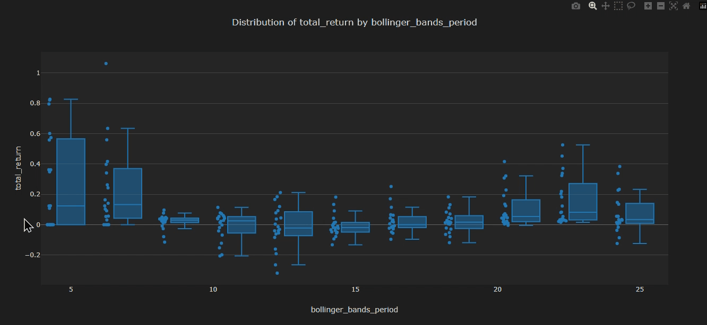
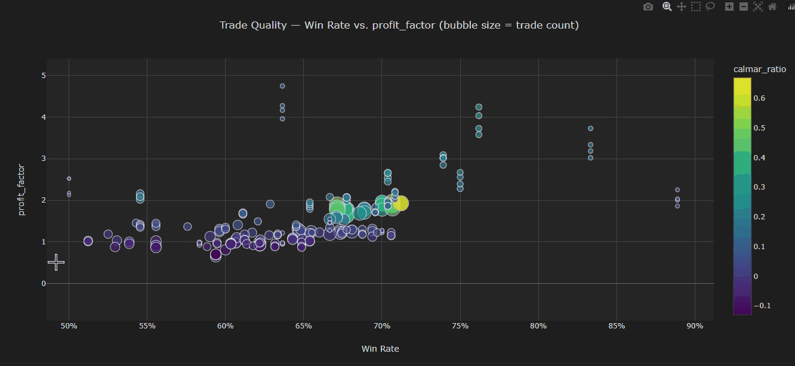
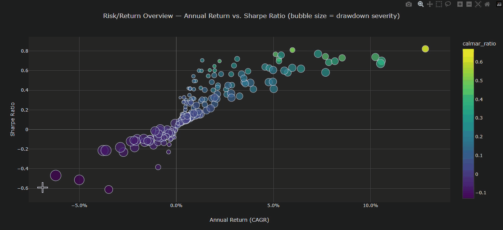

# Contango

<div align="center">
  
  
  
</div>

<div align="center">
  
  
  
</div>

<h6 align="center">
    <a href="./docs/index.md">Documentation</a>
    ·
    <a href="./LICENSE">License</a>
</h6>

<p align="center">
    <a href="https://pypi.org/project/contango/">
        
    </a>
    <a href="https://github.com/igowuu/contango/blob/main/LICENSE">
        
    </a>
    <a href="https://github.com/igowuu/contango/actions/workflows/ci.yml">
        
    </a>
</p>

`Contango` is a python engine to backtest, optimize, create, and graph trading strategies with ease using [Plotly](https://github.com/plotly/plotly.py). Strategies can be parameterized over tens of thousands of parameters to find the optimal regions while allowing unique strategies to be effortlessly compared amongst each other. 

## Features
 
- **Event-driven engine** - strategies react to `MarketDataEvent`, `OrderEvent`, `AcceptedFillEvent`, `PortfolioSnapshotEvent`, and more, published through an event bus with explicit subscriber priorities.
- **Composable brokers & calendars** - historical brokers (e.g. `Yfinance`) fetch OHLCV data, calendars (e.g. `NYSECalendar`) define the trading dates, and a data repository caches everything so you're not re-polling the same bars every run.
- **Grid-search optimization** - sweep a strategy over any number of parameters (`ResearchRunner` / `BacktestExperimentRunner`), and get back a `BacktestExperimentResult` per combination with the raw execution data and metrics attached.
- **Built-in indicators & state machines** - ATR, Bollinger Bands, EMA, RSI, SMA, VWAP, Wilder Average, plus state machines (e.g. `ABOVE`/`BELOW`, `BELOW_LOWER`/`BETWEEN_LOWER_AND_MIDDLE`/etc.) so strategies can signal off of states instead of raw values.
- **Full metric suite** - return, risk, drawdown, and trade metrics (sharpe, calmar, profit factor, expectancy, and more) generated automatically from a backtest's raw events.
- **Seven graph types** - risk/return overview, parameter importance, parallel parameter combinations, pairwise heatmap grid, metric distribution, equity curve overlay, underwater drawdown, and trade quality scatter, all built to help you catch overfitting while determining the profitability and risk of your results (six of them are at the top of the README!).

## Installation (copy-paste)

> Requires: Python 3.11+

**Linux/macOS**
```bash
git clone https://github.com/igowuu/Contango.git && cd Contango && python3 -m venv .venv && source .venv/bin/activate && pip install -r requirements.txt
```

**Windows (PowerShell)**
```powershell
git clone https://github.com/igowuu/Contango.git; cd Contango; python -m venv .venv; .venv\Scripts\Activate.ps1; pip install -r requirements.txt
```

> See [in-depth installation docs](./docs/getting-started/installation.md) if this does not work for you.

## Quickstart

### Run the demo

```bash
python -m research.research_strategies.bollinger_band_mean_reversion.runner
```

This backtests the strategy across a grid of parameters and writes the generated graphs (as HTML files) to `research/research_strategies/bollinger_band_mean_reversion/graphs/`. They can be opened in the browser to explore the results - see [Quickstart docs](./docs/getting-started/quickstart.md) for a walkthrough of serving them locally (e.g. with the VSCode Live Server extension) if opening the files directly doesn't render them how you would expect.

### Create a Strategy

```python
class MyStrategy(Strategy):
    """
    A very simple strategy outline - not all logic is included.
    """
    def on_market_event(self, event: MarketDataEvent) -> None:
        # Strategy market logic here
        if should_buy:
            self.order_api.submit_order(event, "AAPL", quantity=3)
            self.order_api.submit_stoploss_order(event, "AAPL", quantity=-3, stoploss_price=...)
        elif should_sell:
            self.order_api.submit_order(event, "AAPL", quantity=-3)

        self.last_event = event

    def on_end(self) -> None:
        holding = self.portfolio_snapshot.position > 0

        if holding:
            self.order_api.submit_order(self.last_event, "AAPL", quantity=-self.portfolio_snapshot.position)
```

### Run a strategy

```python
def build_config() -> RunConfig[YfinanceConfig]:
    """
    Builds the backtest configuration for a Bollinger Band mean-reversion
    parameter sweep on AAPL daily bars, 2000-2026.
    """
    ticker = "AAPL"
    interval = Interval.DAY_1
    start = datetime(2020, 1, 1)
    end = datetime(2026, 1, 1)

    initial_cash = 1_000
    initial_position = 0
    fill_behavior = FillBehavior.INSTANT
    slippage = 0.001
    commission_per_unit = 0.0

    start_unix_ms = int(start.timestamp() * 1000)
    end_unix_ms = int(end.timestamp() * 1000)

    param_space: dict[str, list[int | float | str]] = {
        "bollinger_bands_period": list(range(5, 26, 2)),
        "bollinger_bands_stdev": [0.5, 1.0, 1.5, 2.0, 2.5],
        "allocation": [0.25, 0.5, 0.75, 1.0],
        "symbol": [ticker],
    }

    return RunConfig[YfinanceConfig](
        broker=Yfinance(NYSECalendar()),
        broker_config=YfinanceConfig(ticker, interval, start_unix_ms, end_unix_ms),
        strategy_factory=MyStrategy,
        param_space=param_space,
        initial_cash=initial_cash,
        initial_position=initial_position,
        fill_behavior=fill_behavior,
        slippage=slippage,
        commission_per_unit=commission_per_unit,
    )


if __name__ == "__main__":
    config = build_config()
    results = ResearchRunner.run(config, verbose_iterating=True)

    graph_dir = "research/research_strategies/my_strategy/graphs/"
    generate_report(results, graph_dir, rank_metric="calmar_ratio")
```

## How it works

The codebase is divided into parts by responsibility:

- **Engine** - defines events (`MarketDataEvent`, `OrderEvent`, etc.), the event bus, the `Strategy` base class, and the order API. This is the shared information that every mode of trading (right now, just the backtester) uses, allowing logic to remain exactly the same between modes in the future.

- **Backtester** - a mode that iterates through OHLCV data and simulates fills, slippage, and commissions against a config, without touching a real broker. It currently does not support pyramiding, multiple tickers, or short trades - orders that violate that will be loudly rejected. This behavior will change in the future.

- **Brokers & calenders** - historical brokers translate an external data provider's format (e.g. Yahoo Finance via `Yfinance`) into `MarketDataEvent` instances. Calendars define which timestamps are actually tradeable, which the data repository uses to only fetch what's missing instead of re-pulling everything.

- **Optimizer** - takes a strategy and a parameter space, runs the full backtest per combination (`BacktestExperimentRunner`), and computes return/risk/drawdown/trade metrics for each one so that you can compare them without touching raw events yourself. See [analysis docs](./docs/trading/optimizer/analysis.md) for what each metric actually means.

- **Graphing** - turns those metrics into the seven generated graphs mentioned above. They're deliberately build to expose overfitting (outliers, noise, luck). Each graph exposes something entirely different, whether it be profitability, high-risk, or whether the strategy even has an edge in the first place. See [graphing ddocs](./docs/trading/analyzer/graphing.md) for how to read them.

For the full breakdown of any of these, start at [docs/index.md](./docs/index.md).

## Usage

See the [documentation](./docs/index.md) for everything not covored above - writing custom indicators, the full events reference, data repository internals, and much more.

## Credits & acknowledgements

- [Plotly](https://github.com/plotly/plotly.py) powers all graph types.
- Historical data is sourced via [Yahoo Finance](https://finance.yahoo.com/).

### Artificial intellegence usage

- Unit tests were developed with AI assistence - [Claude Sonnet 5](https://www.anthropic.com/news/claude-sonnet-5)
- Code reviews were conducted by AI to help debug code - [Claude Sonnet 5](https://www.anthropic.com/news/claude-sonnet-5)

**Developers:**

<div style="width:100px;">
  <a href="https://github.com/igowuu">
    
  </a>
  <div>
    <a>&nbsp;&nbsp;&nbsp;&nbsp;</a>
    <a href="https://github.com/igowuu">igowuu</a>
  </div>
</div>

## License

See [LICENSE](./LICENSE)
