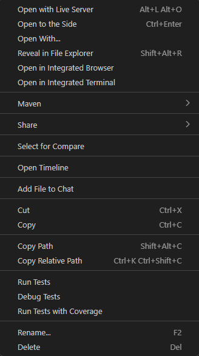
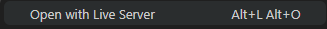
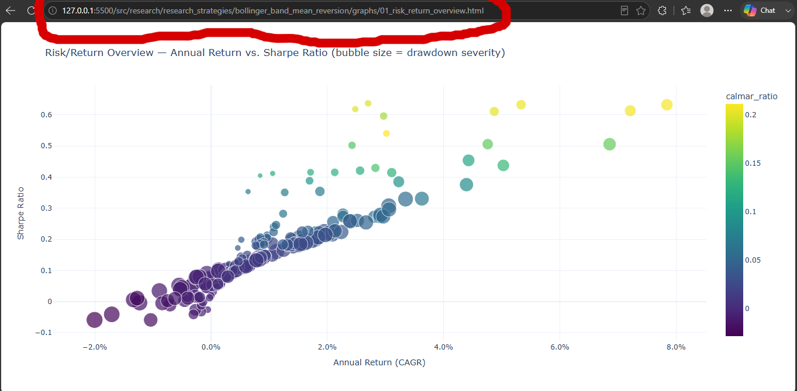
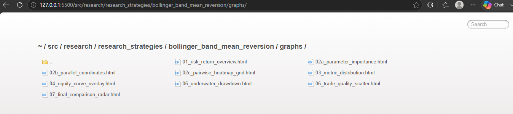

# Quickstart

## Make sure you have correctly installed the project first.
The project comes with some built-in demo files for you to test.

## Backtest a demo file after installation:

```bash
python -m contango.research.research_strategies.bollinger_band_mean_reversion.runner
```

Under the `research/research_strategies/bollinger_band_mean_reversion` directory (in the folder that you ran the demo command in), you should see a graphs/ folder, which contains all of the generated graphs as HTML files. Open the folder, and then open the HTML files.

To do this, use the VSCode [Live Server Extension](https://marketplace.visualstudio.com/items?itemName=ritwickdey.LiveServer) to open the graphs in your defaulted browser. If you already have a way to easily view HTML files: [Jump to Next Steps](#next-steps)

## Setting up a live server

After downloading the extension and right clicking any file in the graphs/ directory, you should see this popup:



Click `Open with Live Server`:



This will take you to any graph page, depending on which HTML file you chose. Take note of the URL:



In my case, the URL was `http://127.0.0.1:5500/src/research/research_strategies/bollinger_band_mean_reversion/graphs/01_risk_return_overview.html`. You want to simply get rid of the graph_name.html section. Your URL name should look similar (if not identical) to this: `http://127.0.0.1:5500/src/research/research_strategies/bollinger_band_mean_reversion/graphs`. This will take you to the graph directory - you can explore the other graphs if you would like.



## Next steps

Once you're here, head to [Graphing](../trading/analyzer/graphing.md) to interpret the generated results.
