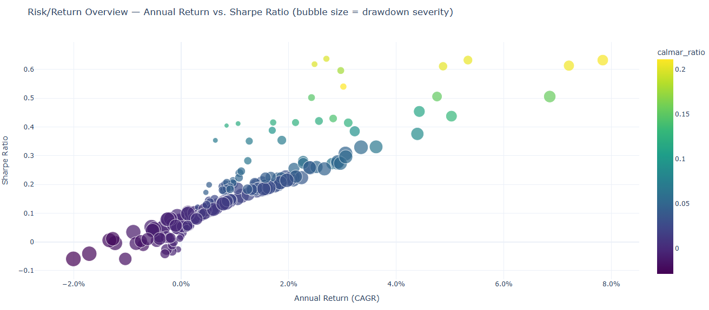
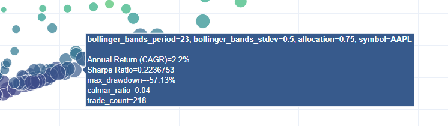
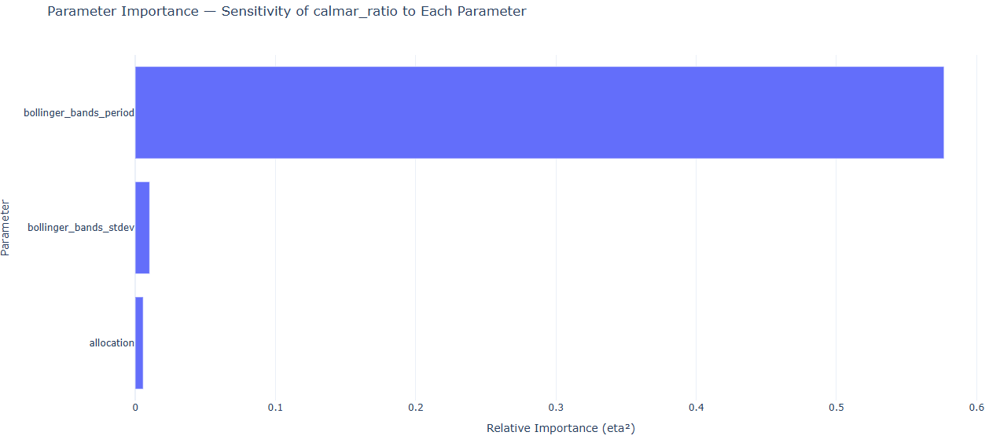
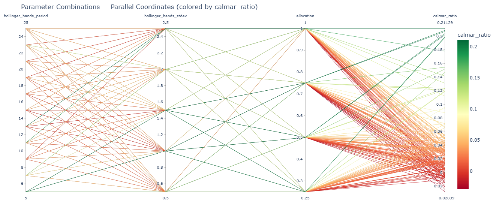
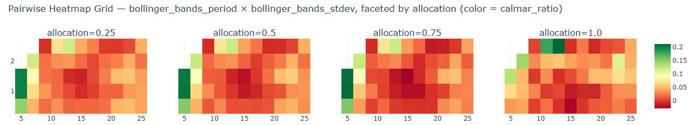
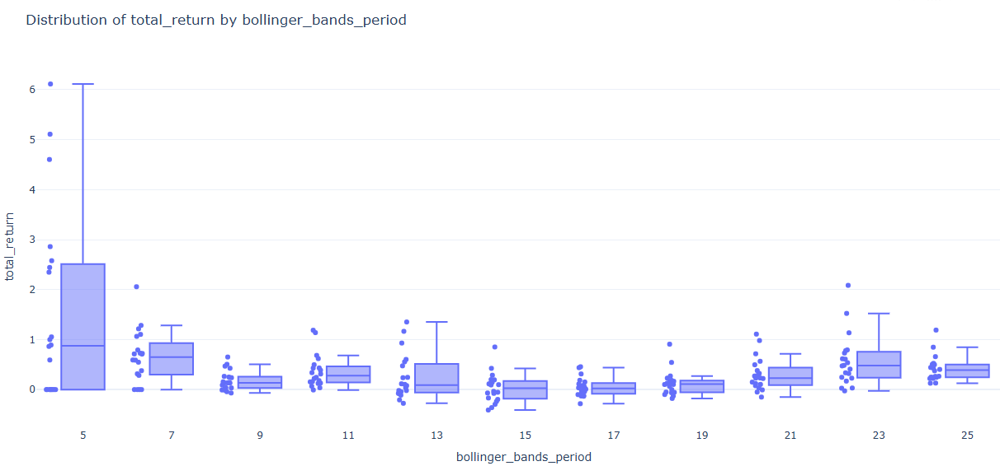
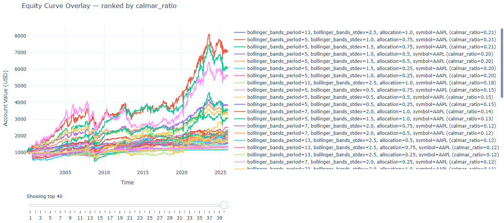
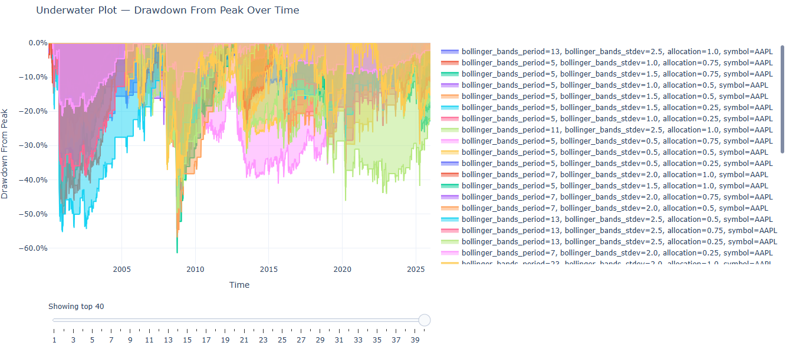
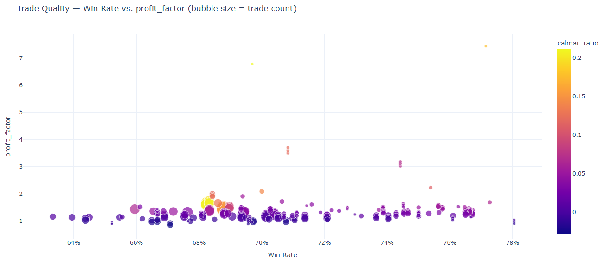
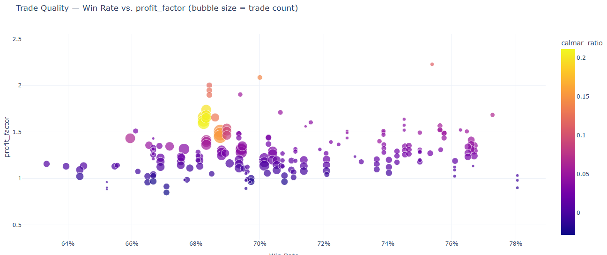

# Graphing

The generated graphs from the metrics reveal the quality of trades, profitability, and risk of the parameters tested for a strategy. The graphs were carefully chosen to all tell something different about the execution of a strategy - this documentation will tell you exactly how to interpret them.

**Prerequisite: you should be familiar with the trading terms used in this project. If you aren't, see [analysis docs](../optimizer/analysis.md).**

**Note: All of the examples here use the demo parameterized bollinger band mean reversion strategy, which is included in the research/ folder. It was tested from the start of 2000 to the start of 2026 using daily bars.**

## Risk Return Overview

### What is it?

The risk return overview compares the `sharpe ratio`, `calmar ratio`, `annual return (CAGR)`, and `max drawdown` amongst the parameterized backtests. 

The x-axis holds the annual return (CAGR), and the y-axis holds the `sharpe ratio`. Larger points indicate a higher max drawdown, and a brighter yellow `calmar ratio` color indicates a higher `calmar ratio`.

### What should you be looking for?

The "optimal" point would be a small point with a brighter yellow color at the top right of the graph; but be warned, this alone does not signify a good strategy. You want to look for clusters and consistencies between parameters (so either clumps or patterns between the points in the graph).

### Things to watch out for:

- Singular outlier points that outperform the rest - this is likely overfitting for certain circumstances rather than a genuine edge.
- Low trade count - hover over the points. If you see a low trade count, you may not want to look at further graphs because your trade count is too low for realistic metrics and results, unless if this is intended.

## Example:

Let's interpret this graph. We see scattered, warm points on the top right of the graph - this does not signify consistency. On the bottom left, we see cooler points clustered together - this is where most of the parameters ended up. The maximum `calmar ratio` reached only ~0.2, so this suggests that the strategy is too risky for the profits to make sense.

Looking at the CAGR (annual return), we see that the clusters are all below a 4.0% annual return, which is low. 

The `sharpe ratio` isn't much better, sitting at 0 to 0.3 for the majority of the points, telling us that the drawdown does not make sense for the little profit the backtests made.

Most of the points are large. Hovering over, we see that a lot of them are at 50-55% drawdown, which is a bad sign (very high risk).

Finally, we see that the trade count sits at around ~200, which is a realistic amount of trades for the 26 years that the strategy traded. There is sufficient amount of data to make conclusions about the strategy.

Just from this first graph, we can conclude that the strategy as is **unprofitable** (assuming good parameters were picked for the test). The risk and drawdown does not make sense for the little profit it generates, which all results in this graph point to.

## Parameter Importance

### What is it?

The parameter importance graph shows which parameters have the most weight in the deviation of results that the strategy generated.

### What should you be looking for?

You should be looking at the size of the bar for each parameter tested & parameterized. A larger bar indicates that a parameter has more weight on the results, while a smaller bar (or no bar) indicates that it has little or no importance on the generated results.

This helps you determine what parameters to tune. You should be focused on tuning parameters with more weight than ones with less of an impact.

### Things to watch out for:

- Not testing enough parameters. If you do not test a variety of a parameter, it will inherently report back as low importance, which could be misleading. Keep note of this.
- Reliance solely on this metric for tuning - even if this graph says that one or two parameters dominate, you should not completely ignore other parameters as they may have importance unrelated to how the variance is calculated. It should influence your tuning, not fully dictate it.

## Example:

As you can see, for the example bollinger band mean reversion strategy, the period dominates. This is a clear indicator as you tune the strategy parameters that the period value will have the most weight, while the allocation and stdev parameters may have less significance.

This graph is relatively easy to interpret; it does not prove strategy profitability, but it helps you tune your strategies no matter the results from any other graphs.

## Parallel Parameter Combinations

### What is it?

Each line is one experiment (backtest); axes are the swept parameters plus the target metric. Lines are colored by the target metric (supplied in the constructor). This graph tells you if a parameter has an optimal zone, or if the majority of the results are possibly noise / overfitting.

### What should you be looking for?

You want to be looking for narrow, green bands (where bands are compositions of multiple lines). Narrow, green bands indicate consistent results across a type of parameter.

On the other hand, narrow & red/orange bands indicate that the strategy is consistently underperforming. This usually indicates that something in the strategy may have an edge, but it isn't being properly taken advantage of.

Worst of all, scattered lines means that there is likely no real consistent edge at all, and that most of your results were random with little or no pattern involved.

### Things to watch out for:

- Not all green lines are good. Even if a strategy produces a decent amount of green results, if not banded together, other market circumstances other than your actual strategy are likely influencing the results.
- Make sure to check the actual observed ranking metric (defaults to calmar ratio) to see if the metric is actually high. For example, green lines mean nothing if the maximum recorded calmar ratio is 0.2 - the strategy is not yielding good results, even though the lines are green & clustered.

## Example:

The range of calmar ratios are from -0.02 to ~0.2 - this in itself is a red flag that the strategy is not yielding good results.

Nonetheless, looking at the leftmost part of the graph, we see that from the period to the stdev parameters, the lines are concentrated in red & orange colors. Now look at the rightmost part of the graph - here, we see (after all parameters are compounded), that there are genuine narrow bands. However, the bands are red / orange, only equating to calmar ratios of -0.02 to 0.06, which is very little. 

The scattered green results are noise. Be careful when analyzing your graph and be sure not to consider them - they typically have no edge and are simply overfitted parameters for these exact results. If you were to use a different dataset, it's very likely that they would not yield good results as they are for this one.

We can conclude once again that this is **unprofitable**, although now we can conclude that it is also **consistent**. There may be an edge, but we are not capitalizing on it with our raw bollinger band mean reversion strategy.

## Pairwise Heatmap Grid

### What is it?

The pairwise heatmap grid shows one heatmap per third parameter (allows for up to three parameters to graph). Each shape in the heatmap grid shows the designated metric (defaults to calmar ratio) as a heated color for a parameter space. The heatmap helps determine if a result is overfitting or has a genuine edge.

### What should you be looking for?

A genuine edge will show a color gradient fading away from a cooler color. For example, if one parameter space was green, the next may be light green or yellow, and the next one after that may be orange or red. 

Overfitting (not an edge) will be extremely obvious - a cooler result surrounded by hotter colors directly adjacent to it.

### Things to watch out for:

- Outliers that hinder your results. The color scale makes the coolest colored result the highest ranking result for that metric. This means that if an outlier yields unrealistic results (calmar ratio of 10.0, for example), the rest of your results will be hotter colors. The best way to combat this is to filter your results programatically to prevent outliers.

## Example

Look at the leftmost heatmap with allocation as 0.25. At the bottom left of the heatmap, there is a dark green area. There seems to be a slight color gradient, but it isn't completely obvious at a glance.

One nuance - the green sector is in the bottom left of the heatmap, which corresponds to a period of 5. This is relatively low, which means that the strategy was trading extremely frequently. This could indicate that the strategy yields more profits (and less risk) by trading more frequently, but it would need more testing with different datasets to confirm this.

Now look at the rightmost heatmap with allocation as 1.0. At the top of the graph, there are two dark green sections surrounded by red. This is likely overfitting, and these sections should not be considered.

We can now conclude that a bollinger band mean reversion strategy *may* have a genuine edge worth testing by altering the logic of the strategy.

## Metric Distribution

### What is it?

The metric distribution shows the variance between the results for a certain parameter. Tight boxes indicate little variance (high consistency), while wide boxes indicate much variance (low consistency). A higher median for the box & whisker plots means that the average of the backtests performed well; a higher upper fence or max does not necessarily mean that those results are consistent.

### What should you be looking for?

You want to look for tight boxes that with medians that yield high returns. Wide boxes indicate inconsistencies and likely randomness, while tighter boxes indicate a possible edge & consistency.

### Things to watch out for:

- Results that never actually traded. If parameters for a backtest never made a trade for a parameter, they may hinder your min & lower fences, although the median should not be significantly affected (unless if the majority of your results never traded).

## Example

Look at the leftmost box with the period parameter as 5. It is significantly wider than all of the other boxes. If you recall from earlier, we said that a period of 5 yielded the highest results of all the parameters, so it may have an edge - this directly refutes that hypothesis. Notice how a few backtests had massive returns, while others had little or no returns, artificially inflating the median. This is why it had a higher calmar ratio than the others.

As for the other boxes, they are tight and narrow. This means that the backtests yielded similar results to each other, so the majority of the periods are consistent. However, notice how low the returns are. Although they are consistent, they are consistently yielding *low* profit.

## Equity Curve Overlay

### What is it?

The equity curve overlay shows the account value over time (USD) for each parameterized strategy. This helps you visualize how each strategy actually performed over time and if there are any unusual behaviors (such as massive dips or massive leaps) in the profits for the strategy. 

### What should you be looking for?

In an ideal world, your profits would be steady & linear. You want to look for some semblance of consistent profits throughout your time period, and no drastic changes based on different market conditions.

### Things to watch out for:

- As usual, you want to look for & ignore any outliers you found beforehand or any wildly high / low results that do not make sense.

## Example

At the top of the equity curve graph, you see that some of the equity curves are more profitable than the others - significantly so. Looking to the right, we notice that they're part of our outlier group, period 5. These should be ignored.

Lower in the graph, notice how all of the equity curves are bundled together, most making very little profit (~110% in 20 years). This aligns perfectly with our previous findings - the strategy is **consistent, but unprofitable** as-is.

## Underwater Drawdown Plot

### What is it?

The underwater drawdown plot tells us the maximum drawdown for the parameterized strategy. Massive maximum drawdowns suggest that the strategy does not handle losses well (or not at all), and is extremely risky because of it. A larger graph going downwards means a larger maximum drawdown.

### What should you be looking for?

You should be looking for small underwater graphs & as always, consistency between different parameter combinations.

Any large graphs going downwards indicate large risk that may or may not be worth it for your strategy. Generally speaking, you want to aim for strategies to be at around -10% drawdown or less (dependant completely on the allocation you are trading).

### Things to watch out for:

- Outliers may artificially inflate the maximum drawdown from peak - as always, either filter them, ignore them, or hide them in the graph.

## Example

From just a glance, you can tell that the drawdown is massive, sitting at -60% for the riskiest strategies. However, you must consider the outliers for this set - we determined that the outliers are mostly all of a period of five. Hide them from the graph by left clicking them on the right sidebar.

Even after hiding them, the core losers stay the same (I didn't include a second picture because it visibly changed nearly nothing). Ignoring the biggest losers, we can see that the majority of parameters are relatively big losers anyway (~-30%). This is a red flag.

What we can determine from this is that the low calmar & sharpe ratios from before were at least partially from the massive drawdowns generated from the parameters. The amount of risk and the little profit generated (CAGR from the risk return overview) results in painfully low calmar ratios. 

## Trade quality scatter

### What is it?

The trade quality scatter compares the win rate on the x-axis, profit factor on the y-axis, trade count by the point size, and a ranking metric (defaults to calmar ratio) as the color.

### What should you be looking for?

The ideal point would be big, yellow, and at the top right of the chart. This isn't very likely though - what you should look for is any decently sized point with a profit factor & win rate that is profitable. Generally speaking, look for a profit factor of above ~1.5 and a win rate over 50%.

### Things to watch out for:

- Outliers that may be caused by overfitting. If there are any wildly high / low results, this either indicates a low trade count (very small dot) or an overfitted parameter set - both should be ignored.

## Example

Looking at the graph, we see that the maximum profit factor is 7.0. This is caused by parameters that resulted in a very low amount of trades. These are outliers. We should zoom in to the concentrated results to exclude the outliers.

You might notice a pattern of nearly identical results having slightly higher profit factors - this is because the allocation has no effect on the win rate, but affects the profit factor. This should be ignored as it is just noise. 

The takeway here is that the strategy has a high win rate (64%-76%) with a very low profit factor (most around 1.2-1.3). As discussed in earlier results, the calmar ratio is still low (maximum of 0.2) and sufficient trades are made for reliable results.

## Conclusion

We can conclude that this strategy is **not sufficiently profitable** as of now. The risk return overview revealed consistently **low calmar ratios**. The parallel parameter combination graph revealed consistency in parameters and a **possible edge** with bollinger bands, although not capitalized with this strategy. The heatmap did not provide any useful information this time, except bringing outliers to our attention. The metric distribution and equity curve both reinforced the same **consistency** we found earlier. The underwater drawdown plot highlighted a major reason for the low results - **massive drawdowns** upon the majority of our backtests. Finally, the trade quality scatter illustrated the **low overall profit factor** (but high win rate) for the strategy.

## What next?

Given this information about the strategy, it must be altered and improved before actually being considered for the real market. We want to capitalize on the faults that we found here. A high drawdown can be reduced with stop losses; specifically, a mean reversion strategy like this would likely benefit from an ATR-based stoploss. Finally, a low profit factor can be improved by implementing another indicator (possibly an EMA or SMA trend factor, but this would have to be thoroughly tested). 

Anyway, I encourage you to experiment yourself! You should be familiar with a good workflow to identify & interpret strategy results.
